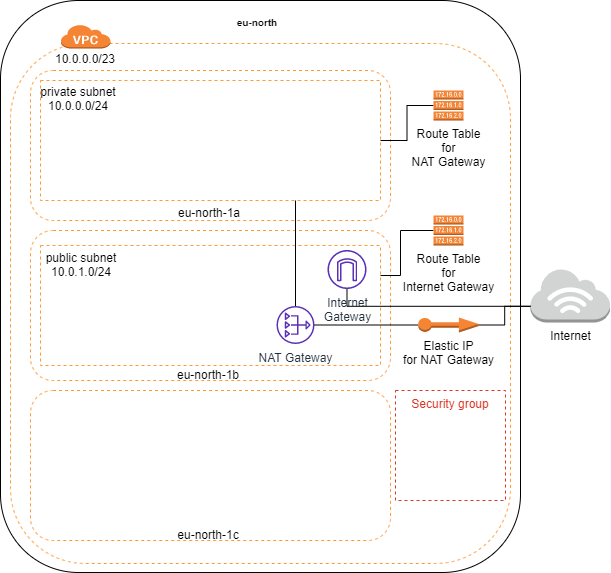

# AWS with Terraform

## Access to AWS

### User

You need an AWS user with full access to policies:

- AmazonVPCFullAccess
- AmazonECS_FullAccess

and the access key and the secret access key.

### Credentials file

Prepare a credentials file with the following structure

```bash
AWS_ACCESS_KEY_ID=
AWS_SECRET_ACCESS_KEY=
AWS_DEFAULT_REGION=
```

and fill out the values after the credentials for the AWS user are generated. The file, in this case, is in folder *aws*.

The repository's folder *terraform* will map to the Docker's volume called *local-git*. Run the following command

```bash
docker run -itd --name terraformer-aws --env-file "aws/credentials" --volume $PWD/terraform:/local-git markokole/terraformer:1.0.3
```

This will start the container. Now step into the container with the following command:

```bash
docker exec -it terraformer-aws /bin/sh
```

## Usage

The home directory is *local-git* - it is advised to enter it right away.

Terraform commands such as *init*, *plan*, *apply* and *destroy* are used once in the module directories.

Module directories available:

- vpc
- ec2

### VPC

Enter directory $HOME/vpc.

Provisioning from this folder creates a VPC with basic resources in it.



### EC2

Enter directory $HOME/ec2.

Provisioning from this folder executes VPC module (located in vpc) and EC2 module. The following infrastructure is built:


