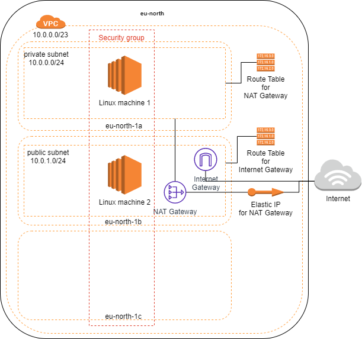

# Terraform modules for provisioning AWS services

Provisioning should not be done directly from this repository, although some folders (test-*) contain code for TEST provisioning. Rather use this repository as the source for Terraform modules in another repository.

## Access to AWS

### User

You need an AWS user with full access (finetune access when going beyond testing) to policies:

- AmazonVPCFullAccess
- AmazonECS_FullAccess

and the access key and the secret access key.

### Credentials file

Create a folder *aws* and prepare a credentials file in the folder with the following key-value structure

```bash
AWS_ACCESS_KEY_ID=
AWS_SECRET_ACCESS_KEY=
AWS_DEFAULT_REGION=
```

### Create work environment

The repository's folder *terraform* will map to the Docker's volume called *local-git*. Change <CONTAINER_NAME> with meaningful name in the below command before executing it.

Run the following command

```bash
docker run -itd --name <CONTAINER_NAME> --env-file "aws/credentials" --volume $PWD/terraform:/local-git markokole/terraformer:1.0.3
```

This will start the container. Now step into the container with the following command:

```bash
docker exec -it terraformer-aws /bin/sh
```

## Usage

The home directory is *local-git* - it is advised to enter it right away.

Terraform commands such as *init*, *plan*, *apply* and *destroy* can be used once in the module directories.

## Modules

### vpc

Virtual Private Cloud

Depending on module: None

Output values:

- project_name
- vpc_id
- subnet_private
- subnet_public
- availability_zone_private
- availability_zone_public

### sg

Security Groups

Depending on module:

- VPC

Output values:

- security_group_id

### ec2

Elastic Compute Cloud

Depending on module:

- VPC
- SG

Output values:

- private_ips

### ecs

Elastic Container Service

Output values:

- ecs_services
- cluster_name

### redshift

Amazon's Datawarehouse

Output values: None

### rds

Relational Database Service

Output values: None

## VPC and SG

Directories $HOME/vpc and $HOME/sg.

These two modules provision a VPC and a security group. VPC id is a requirement for provisioning a security group.


## EC2

Directory $HOME/ec2.

This module provisions one or more EC2 instances, requirement is VPC id and SG id.


